<div align="center">

# 🚨 IntelliShare - Law Enforcement Intelligence Platform


[](https://reactjs.org/)
[](https://www.typescriptlang.org/)
[](https://vitejs.dev/)
[](https://nodejs.org/)
[](https://www.mongodb.com/)
[](https://supabase.com/)


### 🎯 Unified platform for data ingestion, indexing, analytics, and secure inter-agency sharing

[🚀 Features](#-features) • [📦 Installation](#-installation) • [🎨 Tech Stack](#-tech-stack) • [📸 Screenshots](#-screenshots) • [🔐 Security](#-security)

</div>

---

## 🌟 Overview

**IntelliShare** is a cutting-edge **Law Enforcement Intelligence Platform** designed to revolutionize how agencies collect, analyze, and share critical crime data. Built with modern web technologies, it provides real-time analytics, AI-powered insights, and secure inter-agency collaboration.

```mermaid
graph LR
    A[📊 Data Ingestion] --> B[🔍 AI Processing]
    B --> C[📈 Analytics Engine]
    C --> D[🗺️ Visualization]
    D --> E[🤝 Inter-Agency Share]
    E --> F[🎯 Action & Resolution]
    style A fill:#3b82f6,stroke:#1e40af,color:#fff
    style B fill:#8b5cf6,stroke:#6d28d9,color:#fff
    style C fill:#ec4899,stroke:#be185d,color:#fff
    style D fill:#f59e0b,stroke:#d97706,color:#fff
    style E fill:#10b981,stroke:#059669,color:#fff
    style F fill:#ef4444,stroke:#dc2626,color:#fff
```

<div align="center">



</div>

---

## ✨ Features

<table>
<tr>
<td width="50%">

### 🔐 **Authentication & Authorization**
- Multi-role access control (Admin, Officer, Analyst, Read-Only)
- Badge number verification
- Agency-based authentication
- JWT token management
- Session persistence

</td>
<td width="50%">

### 📊 **Advanced Analytics**
- Pattern detection algorithms
- Link analysis & network graphs
- Predictive analytics with AI
- Sentiment analysis
- Anomaly detection

</td>
</tr>
<tr>
<td width="50%">

### 🗺️ **Real-Time Visualization**
- Interactive crime heatmaps
- Geospatial analysis with Leaflet
- Live data updates via WebSocket
- Trend analysis charts
- Activity feed monitoring

</td>
<td width="50%">

### 📥 **Multi-Source Data Ingestion**
- File upload (PDF, Images, Documents)
- Manual case entry
- API integrations (CCTNS, Vahan, IVFRT)
- Scheduled data imports
- Facial recognition (face-api.js)

</td>
</tr>
<tr>
<td width="50%">

### 🔍 **Deep Intelligence Search**
- Cross-database querying
- CCTNS criminal database
- Vahan 4.0 vehicle registry
- Immigration records (IVFRT)
- FIU-IND financial logs
- Entity extraction & linking

</td>
<td width="50%">

### 🤝 **Inter-Agency Collaboration**
- Secure data sharing protocols
- Access request management
- Audit logging
- 256-bit encryption
- Role-based permissions

</td>
</tr>
</table>

<div align="center">

</div>

---

## 🎨 Tech Stack

<div align="center">

### **Frontend**


### **Backend**


### **AI & Analytics**


### **Infrastructure**


</div>

---

## 📦 Installation

### **Prerequisites**

<div align="center">


</div>

### **🚀 Quick Start**

```bash
# 1️⃣ Clone the repository
git clone https://github.com/yourusername/intellishare.git
cd intellishare

# 2️⃣ Install dependencies
npm install

# 3️⃣ Set up environment variables
# Create .env.local file in root directory
echo "GEMINI_API_KEY=your_gemini_api_key_here" > .env.local

# 4️⃣ Start the development server
npm run dev

# 5️⃣ Open your browser
# Navigate to http://localhost:3000
```

### **🔧 Backend Setup**

```bash
# Navigate to backend directory
cd backend

# Install backend dependencies
npm install

# Create .env file
cat > .env << EOF
PORT=5000
MONGO_URI=mongodb://localhost:27017/intellishare
JWT_SECRET=your_jwt_secret_key
FRONTEND_URL=http://localhost:3000
EOF

# Start backend server
npm start
```

<div align="center">

</div>

---

## 📁 Project Structure

```
intellishare/
├── 📂 backend/
│   ├── 📂 controllers/
│   │   └── authController.js      # Authentication logic
│   ├── 📂 models/
│   │   ├── User.js                # User schema
│   │   └── Case.js                # Case schema
│   └── server.js                  # Express server
│
├── 📂 components/
│   ├── 📂 Analytics/              # Analytics modules
│   │   ├── AnalyticsDashboard.tsx
│   │   ├── PatternDetection.tsx
│   │   ├── PredictiveAnalytics.tsx
│   │   ├── LinkAnalysis.tsx
│   │   ├── SentimentAnalysis.tsx
│   │   └── NetworkGraph.tsx
│   │
│   ├── 📂 Auth/                   # Authentication
│   │   ├── Login.tsx
│   │   └── Register.tsx
│   │
│   ├── 📂 Cases/                  # Case management
│   │   ├── CaseList.tsx
│   │   └── CaseDetail.tsx
│   │
│   ├── 📂 Dashboard/              # Main dashboard
│   │   ├── Dashboard.tsx
│   │   ├── CrimeHeatmap.tsx
│   │   ├── StatsCard.tsx
│   │   ├── ActivityFeed.tsx
│   │   └── TrendingPatterns.tsx
│   │
│   ├── 📂 Ingestion/              # Data ingestion
│   │   ├── DataIngestion.tsx
│   │   ├── FileUpload.tsx
│   │   ├── ManualEntry.tsx
│   │   ├── APIIntegration.tsx
│   │   └── ScheduledImports.tsx
│   │
│   ├── 📂 Search/                 # Search module
│   │   └── SearchModule.tsx
│   │
│   └── 📂 Share/                  # Inter-agency sharing
│       └── InterAgencyShare.tsx
│
├── 📂 contexts/
│   ├── AuthContext.tsx            # Auth state management
│   └── ThemeContext.tsx           # Theme management
│
├── 📂 data/
│   └── mockData.ts                # Mock data for demo
│
├── 📂 lib/
│   └── supabaseClient.ts          # Supabase configuration
│
├── App.tsx                        # Main app component
├── types.ts                       # TypeScript definitions
├── package.json                   # Dependencies
├── vite.config.ts                 # Vite configuration
└── tsconfig.json                  # TypeScript config
```

---

## 🎯 Key Components

### **1. Authentication System**

```typescript
// Multi-role authentication with JWT
- Administrator: Full system access
- Officer: Case management & field operations
- Analyst: Analytics & reporting
- Read-Only: View-only access
```

### **2. Dashboard Features**

<div align="center">

| Feature | Description | Technology |
|---------|-------------|------------|
| 📊 **Stats Cards** | Real-time case statistics | React + Recharts |
| 🗺️ **Crime Heatmap** | Geospatial crime visualization | Leaflet.js |
| 📈 **Trend Analysis** | Pattern detection & forecasting | AI/ML Algorithms |
| 🔔 **Activity Feed** | Live system notifications | WebSocket |

</div>

### **3. Data Ingestion Pipeline**

```mermaid
graph TD
    A[📤 Upload Source] --> B{File Type?}
    B -->|PDF| C[Text Extraction]
    B -->|Image| D[OCR Processing]
    B -->|JSON/XML| E[Direct Parse]
    C --> F[Entity Extraction]
    D --> F
    E --> F
    F --> G[AI Classification]
    G --> H[Database Storage]
    H --> I[Index & Search]
    style A fill:#3b82f6
    style F fill:#8b5cf6
    style G fill:#ec4899
    style H fill:#10b981
```



### **4. Analytics Engine**

- **Pattern Detection**: Identifies crime patterns across time and location
- **Link Analysis**: Discovers connections between entities (persons, vehicles, phones)
- **Predictive Analytics**: Forecasts crime hotspots using ML models
- **Sentiment Analysis**: Analyzes social media and reports for threat assessment

---

## 🔐 Security Features

<div align="center">

| Security Layer | Implementation |
|----------------|----------------|
| 🔒 **Encryption** | 256-bit AES encryption for data at rest |
| 🔑 **Authentication** | JWT tokens with 24-hour expiry |
| 🛡️ **Authorization** | Role-based access control (RBAC) |
| 📝 **Audit Logging** | Complete activity tracking |
| 🔐 **API Security** | Helmet.js + CORS protection |
| 🚨 **Data Validation** | Input sanitization & validation |

</div>

---


## 🚀 API Integrations

<table>
<tr>
<td width="50%">

### **Government Databases**
- 🏛️ **CCTNS** - Crime & Criminal Tracking Network
- 🚗 **Vahan 4.0** - Vehicle Registration Database
- ✈️ **IVFRT** - Immigration & Visa Records
- 💰 **FIU-IND** - Financial Intelligence Unit

</td>
<td width="50%">

### **AI Services**
- 🤖 **Google Gemini** - Natural language processing
- 👤 **Face-API.js** - Facial recognition
- 📊 **Custom ML Models** - Pattern detection
- 🔮 **Predictive Analytics** - Crime forecasting

</td>
</tr>
</table>

---

## 🎓 Usage Guide

### **Login Credentials (Demo)**

```
📧 Email: admin@bprd.gov.in
🔑 Password: password
👤 Role: Administrator
🏢 Agency: BPRD
```

### **Quick Actions**

1. **Create New Case**: Dashboard → "New Case File" button
2. **Search Intelligence**: Dashboard → "Launch Search Tool"
3. **View Analytics**: Navigate to Analytics tab
4. **Share Data**: Go to Inter-Agency Share module
5. **Upload Files**: Data Ingestion → File Upload tab

---

## 🛠️ Development

### **Available Scripts**

```bash
# Development server with hot reload
npm run dev

# Build for production
npm run build

# Preview production build
npm run preview

# Run backend server
cd backend && npm start
```

### **Environment Variables**

```env
# Frontend (.env.local)
GEMINI_API_KEY=your_gemini_api_key

# Backend (.env)
PORT=5000
MONGO_URI=mongodb://localhost:27017/intellishare
JWT_SECRET=your_secret_key
FRONTEND_URL=http://localhost:3000
```

---

## 🤝 Collabrators

<div align="center">
Team ZION
Rahul Wakhale
Yatharth Chhabra
Vijay Kumar Saini
</div>

---

## 📄 License

This project is licensed under the **MIT License** - see the [LICENSE](LICENSE) file for details.

---

## 🙏 Acknowledgments

<div align="center">

- **Bureau of Police Research & Development (BPRD)** for domain expertise
- **National Crime Records Bureau (NCRB)** for data standards
- **Open Source Community** for amazing tools and libraries

</div>

---


## 📊 Project Stats

<div align="center">


</div>

---

<div align="center">

### 🌟 Star this repository if you find it helpful!


**Made with ❤️ for Law Enforcement Agencies**

[](https://visitorbadge.io/status?path=https%3A%2F%2Fgithub.com%2Fyourusername%2Fintellishare)

</div>

---

## 🗺️ Roadmap

- [x] Core authentication system
- [x] Dashboard with real-time analytics
- [x] Multi-source data ingestion
- [x] Crime heatmap visualization
- [x] Deep intelligence search
- [ ] Mobile application (iOS/Android)
- [ ] Blockchain-based evidence chain
- [ ] Advanced AI threat prediction
- [ ] Multi-language support
- [ ] Offline mode capability

---

<div align="center">

**⚡ Powered by Modern Web Technologies | 🔒 Secure by Design | 🚀 Built for Scale**

</div>
